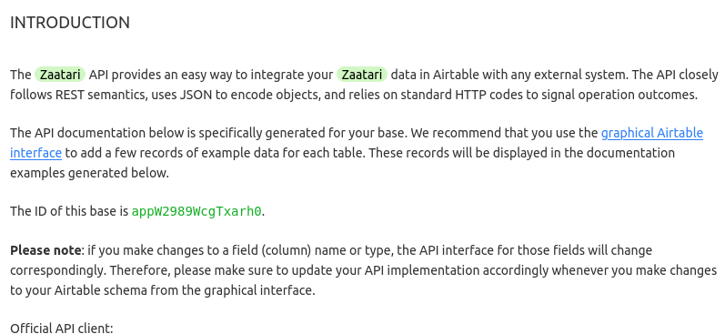

# Handover


- [Handover](#handover)
	- [Introduction](#introduction)
	- [What is Airtable and some Airtable terms](#what-is-airtable-and-some-airtable-terms)
	- [In the current state the website has the following features for voluteers to interact with.](#in-the-current-state-the-website-has-the-following-features-for-voluteers-to-interact-with)
	- [Things the website doesn't do](#things-the-website-doesnt-do)
	- [Warning: don't change column or table names](#warning-dont-change-column-or-table-names)
	- [How to...](#how-to)
		- [Add or edit a workshop](#add-or-edit-a-workshop)
			- [workshop_id](#workshop_id)
			- [workshop_authors](#workshop_authors)
			- [title](#title)
			- [overview](#overview)
			- [content](#content)
				- [Formatting text](#formatting-text)
					- [Formatting text with Airtable editing tools](#formatting-text-with-airtable-editing-tools)
					- [Fomatting text with an external Markdown editor like HackMd](#fomatting-text-with-an-external-markdown-editor-like-hackmd)
				- [Embedding audio and video](#embedding-audio-and-video)
			- [carousel_pictures](#carousel_pictures)
			- [worksheets](#worksheets)
			- [duration](#duration)
			- [date_created](#date_created)
			- [feedback and average_rating](#feedback-and-average_rating)
		- [Add an author to the authors table](#add-an-author-to-the-authors-table)
		- [Share Airtable access with someone else](#share-airtable-access-with-someone-else)

----

## Introduction

Thanks for reading the handover documentation.

The code for this website is publicly available at https://github.com/fac19/Zaatari-Radio. The website is deployed with a service called Netlify. The website's url is currently https://radio-zaatari.netlify.app/. To check the deployment status, you can go to www.netlify.com and log in with the Netlify login credentials (below). The website gets data from Airtable, a database-as-a-service platform. It is through airtable that a volunteer can update the contents of the website. We will send you login credentials in a separate, private form.


## What is Airtable and some Airtable terms

Airtable is a database as a service. What this means from a volunteer's end is that it is a spreadsheet that their website reads from and writes to. Every time someone loads the site, the site will send a new request to get the data from the Airtable 'base'.

A base in airtable is a collection of sheets, like an .xlcs (Excel) file. Sheets in Airtable are also called tables. Your base is called Zaatari, and it contains three sheets.

These are workshop_authors, workshops and feedback. workshops is where you will do most of your work. It is where you will add a new workshop. workshop_authors lets you add to the list of valid authors, a list that you can use in workshops (for details on how this works, read the how to's at the end of this document). The feedback sheet is managed automatically by the website, and you do not need to edit it.

Each sheet is composed of columns and rows. Rows represent entries, for instance in the workshops table a single row is a single workshops. Columns, then, represent properties of entries. Each column has a predefined data type that constrains what can be entered.

Some items are references to other sheets in the same base. In `workshop_authors`, `workshops` is a link to `workshop_id` in `workshops`, and vice versa. You can tell a link to another sheet because these links have a light blue background. 


## In the current state the website has the following features for voluteers to interact with. 

As the creator of an audio workshop you can
- upload the outline of the workshop (known as the workshop contents). 
- embed soundcloud links within the content allowing you to play back accompanying audio. 
- attach additional worksheets to the workshop which are downloadable for other users.

As a voluteer looking to administer a workshop you can 
- browse a list of existing workshops. 
- see the overview and content of workshops which also has accompanying audio examples to playback.  
- download worksheets. 
- leave feedback. This includes a public comment which other voluteers can see when looking at the workshop overview.


## Things the website doesn't do
1. In the current state the workshop content is controlled via the Airtable database and tables, meaning there is no login / sign-up feature. All workshops are public and the ability to leave feedback is also public. A future feature would be to submit workshop content via the website and to implement authentication in order to leave feedback. 
2. Display multiple images per workshop. 
3. Search through the list of workshops.
4. Give workshops tags and sort by tag


## Warning: don't change column or table names

Airtable tables and columns are named "strictly" in order for the website to pull the correct data from the tables. If they are changed or removed there is a quick cntrl + z fix. 

If that doesn't work there is a picture below of the correct layout of the tables and their respective column names.


You can also find these images higher-res in the images/base/ folder of this directory.

If resetting the base still doesn't work, you should try resetting your Airtable base id in netlify. To get your airtable base id, go to this link,

    https://airtable.com/api

and click on `Zaatari` at the bottom. You must be signed in to airtable. Once you've done that, find the base id. 


^^ You don't need to read any of this text - just get the green ID.


Then you need to go to www.netlify.com, log in, click on `sites > Radio Zaatari > Site Settings > Build and Deploy>Environment > Edit Variables`

## How to...

### Add or edit a workshop

To add or edit a workshop, you should edit the `workshops` table in the `zaatari` base. To add A new workshop, click the little plus under the numbers on the left. 


To edit a workshop, just click on a cell. Different cells contain different kinds of data. I'll now go over every column.

#### workshop_id
This is an auto-generated number. You never need to touch it.

#### workshop_authors
This is a link to another table (the `workshop_authors` table). To add an author from that table to a cell in the `workshops` table, select a cell in the column `workshop_authors` and a popup will appear with a list of authors. Select the author that you want. To add an author who is not in the workshop_authors table, see "Add an author to the authors table" below.

#### title
This is the title of your workshop. It allows a single line of unformatted text, so linebreaks and formatting syntax, including markdown if you know it, won't work here.

#### overview
This is the overview passage of your workshop, visible in the workshop overview section. It allows multiple lines of formatted text. For the formatting rules, see the section below, "content"

#### content
This is how you add the content of your workshop. To edit it, click on the cell, and then on the blue diagonal double-arrow to open up a better editor. 


The content column allows you to enter formattted text and embed audio.

##### Formatting text
Rich (i.e. formatted) text is stored in the database in a format called Markdown. However, airtable provides an interface that writes Markdown for you. This means that you have two options for entering workshops: using the Airtable interface or writing your own Markdown and copying it in. 

###### Formatting text with Airtable editing tools
You can format text with the Airtable editing tools easily, but you get limited control. To use the Airtable editing tools, write some text in the expanded view (after having clicked the double blue arrow) and then select the text you want to format. You will get some editing options. If for any reason you find these options inadequate, I recommend that you use an editor which gives you more fine-grained control of your Markdown.

###### Fomatting text with an external Markdown editor like HackMd

Don't be scared off by the name, HackMD is really useful! HackMD is like google docs but for markdown. If you go to https://hackmd.io/ , log in, and create a new note, you can start editing. HackMD displays the raw markdown in black, and the formatted output in white. There are three view modes, editing, side-by-side, and output mode.


HackMD lets you do a few more things than the Airtable editor and is a bit smoother. For instance, you can select header sizes in HackMD. Drafting your workshops in HackMD also minimises the time during which work in progress workshops are available on the site. However, a downside of this is that Airtable has diverted from standard Markdown syntax, and doesn't support the kind of links that HackMD will create. To create a link, you should use the link option in the Airtable interface. Alternately, you could just put the link in directly, so that people can see the url.


##### Embedding audio and video
To embed audio you drop some code from the soundcloud website into the content field, wherever you would like the audio to appear. 

To get the code, find a track on Soundcloud, click on share, click on embed, and then copy and paste the code. It will look something like this:

```htmlmixed=
<iframe width="100%" height="300" scrolling="no" frameborder="no" allow="autoplay" src="https://w.soundcloud.com/player/?url=https%3A//api.soundcloud.com/playlists/781904760&color=%23ff5500&auto_play=false&hide_related=false&show_comments=true&show_user=true&show_reposts=false&show_teaser=true&visual=true"></iframe><div style="font-size: 10px; color: #cccccc;line-break: anywhere;word-break: normal;overflow: hidden;white-space: nowrap;text-overflow: ellipsis; font-family: Interstate,Lucida Grande,Lucida Sans Unicode,Lucida Sans,Garuda,Verdana,Tahoma,sans-serif;font-weight: 100;"><a href="https://soundcloud.com/soundcloud-scenes" title="Scenes" target="_blank" style="color: #cccccc; text-decoration: none;">Scenes</a> · <a href="https://soundcloud.com/soundcloud-scenes/sets/pride-queer-pop-indie" title="Queer Pop &amp; Indie" target="_blank" style="color: #cccccc; text-decoration: none;">Queer Pop &amp; Indie</a></div>
```

Once you've got the code, you should drop it into the content box for the workshop. Finally, you should trim it. The code here is organised with tags, like `<iframe></iframe>` or `<div></div>`. The opening tag has no slashes, and the closing tag has a forward slash at the beginning. Everything in between is part of the tag. We only want the iframe tag, not the div tag, so select everything after `</iframe>` and delete it.

And that's it, your audio should be in your workshop. You can use the same technique, of dropping in an iframe tag, to insert video from YoutTube. 

Note: don't insert tags from untrusted website: a hacker could write tags that would hack people that used the workshop. 

#### carousel_pictures
Deceptively named, this is currently a space to drop in a single picture.

#### worksheets
This is a place to drop in files, which will be available for download in the worksheets page of the workshop. 

#### duration
This is a number of hours that the workshop should take

#### date_created
This is a single-line-text field like the title. You can enter the date in any format you like. 

#### feedback and average_rating
These two columns are automated, and you needn't edit cells in either column. Feedback elements are references to the feedback cell.

   
### Add an author to the authors table
Adding an author is very similar to adding a workshop. author_id is auto-generated and you shouldn't need to touch it. The rest of the fields are self-explanatory except, perhaps, workshops.

workshops is a reference to the workshops table. You can add an author to a workshop here, by clicking on the field and selecting a workshop, or in workshops, by clicking on a cell in the workshop_authors column and assigning an author. 


### Share Airtable access with someone else
To share Airtable access with someone else, hit the share button in the top right. We recommend that you only give editor rights. 
